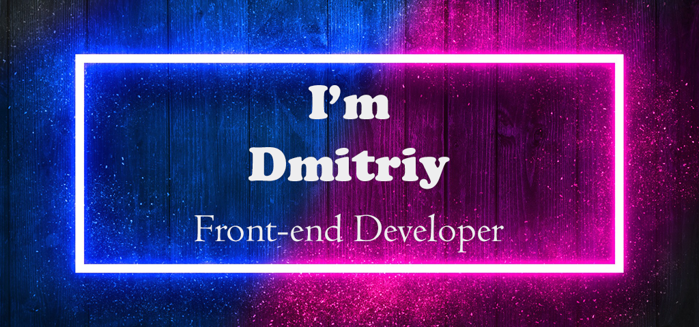

<h3 align = "center">

           
</h3>

## ***Some facts about me*** 

💻 Telecommunication engineer

🎖️ During 15 years was working in a military sphere

🌍  Now I decided to change my life and am in search of possibilities to change it for the best

⭐ I won’t be satisfied unless the problem is solved because I am always focused on result

🧠 I show a lot of promise and my mind is buzzing with exciting ideas

🛠 My hobby is creating leather items such as wallets, bags, coin and key holders , and I also projected and made a few woodbeds

⚽ I prefer football, volleyball, tennis and swimming as my sport activities

🕺 I used to study in a choreographic school

👪 My family is my treasure. Together with my wife we are bringing up our 2 nice boys. My wife always says that I’ve got golden hands

⌨️ I am sure that it’s really cool when you can write a code

💥 Hope that there is a place under the sun in IT sphere for such a gentle, motivated and determined man like me. 

## ***My stats on Github***

## ***Some humor***

-----------

### **Contact  me**

 <a href="https://www.linkedin.com/in/dmitriy-hlubokiy-313a79222/"> <a href="https://www.instagram.com/groont89/">  <a href="https://www.codewars.com/users/groont89/"> 

<!--     -->

<!--  -->

<!--  -->

<!--  -->

<!--  -->
